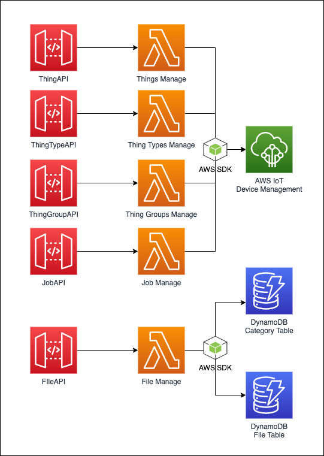

# CDK Construct - IoT Device Management

[](https://badge.fury.io/js/%40softchef%2Fcdk-iot-device-management)


IoT device management is composed of things, thing types, thing groups, jobs, files API services. The constructs can be used independently, that are based on full-managed service to create an API Gateway & Lambda function.



## Installation

```sh
npm install @softchef/cdk-iot-device-management

or

yarn add @softchef/cdk-iot-device-management

```

## Why

- Integrate RestAPI and AWS IoT core to implement access control.
- Manage device firmware information.
- Manage device, such as create an OTA jobs.

This construct library provides five constructs:

- **ThingTypeApi** - Create and modify thing types' information.
- **ThingApi** - Create and modify things' information.
- **ThingGroupApi** - Create and modify thing groups' information.
- **JobApi** - Create and modify thing's jobs.
- **FileApi** - Integrate API Gateway and DynamoDB to store device firmware information.

## Constructs

### Thing Type API

Use thing type API to manage thing types.

```typescript
import { ThingTypeApi } from '@softchef/cdk-iot-device-management'

const thingTypeApi = new ThingTypeApi(scope, id, {
  authorizationType?: apigateway.AuthorizationType;
  authorizer?: apigateway.IAuthorizer
})
```

[Thing Type API Docs](./docs/thing-type-api.md)

### Thing API

Use thing API to manage things' information.

```typescript
import { ThingApi } from '@softchef/cdk-iot-device-management'

const thingApi = new ThingApi(scope, id, {
  authorizationType?: apigateway.AuthorizationType;
  authorizer?: apigateway.IAuthorizer
})
```

[Thing API Docs](./docs/thing-api.md)

### Thing Group API

Use thing API to manage thing groups' information.

```typescript
import { ThingGroupApi } from '@softchef/cdk-iot-device-management'

const thingGroupApi = new ThingGroupApi(scope, id, {
  authorizationType?: apigateway.AuthorizationType;
  authorizer?: apigateway.IAuthorizer
})
```

[Thing Group API Docs](./docs/thing-group-api.md)

### Job API

Use job API to manage jobs' information.

```typescript
import { JobApi } from '@softchef/cdk-iot-device-management'

const jobApi = new JobApi(scope, id, {
  authorizationType?: apigateway.AuthorizationType;
  authorizer?: apigateway.IAuthorizer;
  scheduleFunction: ScheduleFunction
})
```

> The [ScheduleFunction](https://www.npmjs.com/package/@softchef/cdk-schedule-function/v/0.0.15) is support to custom create job by schedule time.

[Job API Docs](./docs/job-api.md)

### File API

Use File API to manage IoT devices firmware. File API contains category and file.

```typescript
import { FileApi } from '@softchef/cdk-iot-device-management'

const FileApi = new FileApi(scope, id, {
  authorizationType?: apigateway.AuthorizationType;
  authorizer?: apigateway.IAuthorizer;
})
```

[File API Docs](./docs/file-api.md)

## DynamoDB Tables

### Category Table Schema

| Name        | Schema | Primary Index | GSI(Query By ParentId) |
| ----------- | ------ | ------------- | ---------------------- |
| categoryId  | String | Partition Key |                        |
| parentId    | String |               | Partition Key          |
| name        | String |               |                        |
| description | String |               |                        |

### File Table Schema

| Name         | Schema | Primary Index | GSI(Query By CategoryId And Locale) | GSI(Get File By Checksum And Version) |
| ------------ | ------ | ------------- | ----------------------------------- | ------------------------------------- |
| fileId       | String | Partition Key |                                     |                                       |
| categoryId   | String |               | Partition Key                       |                                       |
| checksum     | String |               |                                     | Partition Key                         |
| version      | String |               |                                     | Sort Key                              |
| checksumType | String |               |                                     |                                       |
| location     | String |               |                                     |                                       |
| locale       | String |               | Sort Key                            |                                       |
| summary      | String |               |                                     |                                       |
| description  | String |               |                                     |                                       |
| updatedAt    | Number |               |                                     |                                       |
| createdAt    | Number |               |                                     |                                       |

## License

This code is licensed under the Apache License 2.0. See the [LICENSE](https://github.com/SoftChef/cdk-iot-device-management/blob/main/LICENSE) file.
